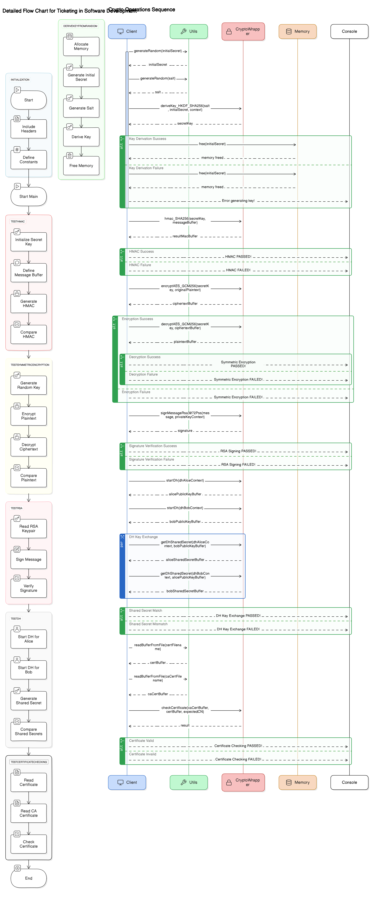
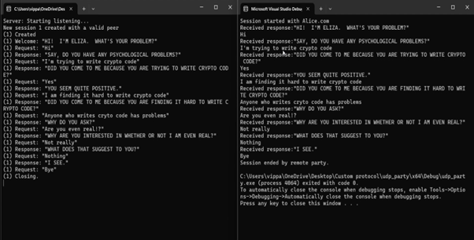
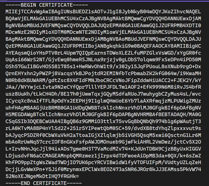
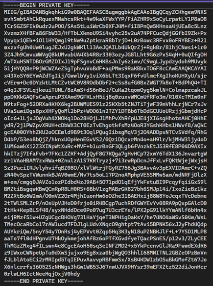
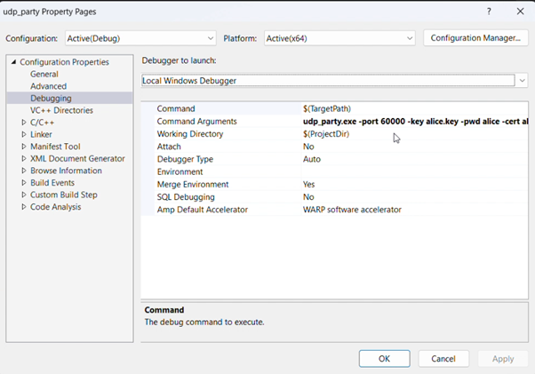
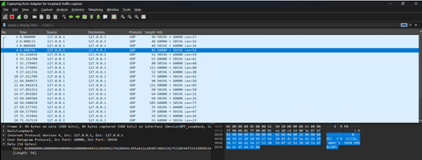

# Cryptography_Simulation_with_OpenSSL

## Table of Contents
- [Project Description](#project-description)
- [Features](#features)
- [Architecture](#architecture)
- [Installation](#installation)
- [Workflow](#workflow)
- [Output](#output)
- [Team](#team)

## Project Description
This project is a part of the Intel Unnati Industrial Training program.This aims to implement and simulate cryptographic algorithms and protocols using the mbedTLS or OpenSSL libraries. It focuses on demonstrating encryption, decryption, and secure communication techniques essential for ensuring data privacy and integrity in various applications. Key cryptographic algorithms such as RSA, AES, and ECC will be implemented to showcase asymmetric and symmetric encryption methods. The project will also cover the use of Digital Certificates, TLS/SSL protocols for secure communication, and Hash Functions like SHA-256 for data integrity verification. This project illustrates a strong implementation of cryptographic algorithms that result in an interactive tool that serves as an educational resource for understanding and experimenting with cryptography

## Features
- Secure communication using AES-GCM for encryption.
- Asymmetric encryption using RSA.
- Key exchange using Diffie-Hellman.
- Digital signatures and certificate management.
- Network communication over UDP.

## Architecture
The project consists of the following main components:
- Client: Initiates communication and sends data.
- Server: Receives communication and processes data.
- Crypto Wrapper: Provides cryptographic functionalities.
- Certificate Authority (CA): Manages digital certificates.

Detailed architecture and process flow can be found in the project documentation.

## Installation
### Prerequisites
- Windows/Linux operating system
- Microsoft Visual Studio (for Windows) or GCC (for Linux)
- mbedTLS/OpenSSL libraries

## Workflow
1.	Design and Architecture
•	System Architecture Design:
-Create an architectural diagram outlining components and their interactions (e.g., key generation, encryption, decryption, certificate management).
•	File Encryption Application Design:
-Design the structure and flow for the command-line interface (CLI) application, specifying user interactions and outputs.
2.	Implementation
•	Setup Development Environment:
- Install necessary software tools (mbedTLS, OpenSSL, Python).
-Configure development IDE or text editor (e.g., Visual Studio Code, Vim).
•	Algorithm and Protocol Implementation:
- Implement RSA for key generation, encryption, and decryption.
- Implement AES for symmetric encryption and decryption.
-	Implement ECC for key exchange or digital signatures.
-	Implement SHA-256 for hashing messages.
-	Integrate TLS/SSL protocols for secure communication channels.
•	Digital Certificate Management:
-	Develop functions to create, manage, and verify digital certificates.
3.	Testing and Validation
•	Unit Testing:
-	Develop and execute unit tests for each cryptographic algorithm and protocol.
•	Integration Testing:
-	Test the integration of algorithms and protocols within the CLI application.
•	Security Testing:
-	Perform security analysis and vulnerability assessment.
-	Validate secure handling of cryptographic keys and sensitive data.

## Output
()

()

()

()

()

## Team
VIPPAGUNTA HIMACHARITHA
 - As a team leader, I Designed the overall architecture of the project and I also contributed my part by managing, communicating and motivating my team members along with the sprints of the project.  
PAVANA MADDIREDDY 
- As a team member, I developed the crypto wrapper using OpenSSL and test cryptographic functionalities(ex: AES-GCM, RSA, SHA-256,DH)
PUTTA VENKATA PUSHPA 
- As a team member, I Implemented and managed the socket communication for the client and the server applications. Also, Ensure the cryptographic protocols are secure and efficient. 
ARIGELA YASHASWINI
 - As a team member, I ensured reliable and secure network communication over UDP and monitored network traffic by analysing it using Wireshark. Also, Troubleshoot and resolve any network related issues.
MINI GADHIRAJU 
- As a team member, I provided support for certificate management by generating certificates, signing certificates and verifying them. 

